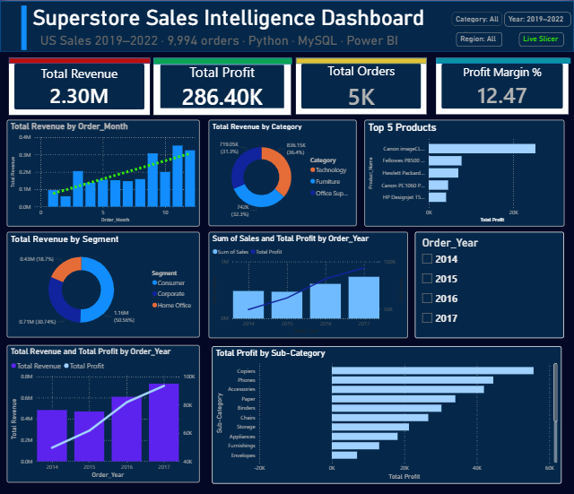

# Superstore Sales Intelligence Dashboard


> End-to-end retail sales analytics project analyzing **9,994 orders** across  
> **2019–2022** using Python, MySQL & Power BI to uncover revenue trends,  
> profit drivers, and customer segment insightS.

---

## Dashboard Preview



---

## Table of Contents
- [Problem Statement](#-problem-statement)
- [Project KPIs](#-project-kpis)
- [Tech Stack](#-tech-stack)
- [Project Files](#-project-files)
- [Project Workflow](#-project-workflow)
- [Key Business Findings](#-key-business-findings)
- [How to Run](#-how-to-run)
- [Dataset](#-dataset)
- [Connect with Me](#-connect-with-me)

---

## Problem Statement

A US-based retail superstore with operations across **3 product categories**,  
**4 regions**, and **3 customer segments** needed a complete analytics solution to:

- Identify which **product categories and sub-categories** are profitable vs loss-making
- Understand **customer segment behavior** (Consumer, Corporate, Home Office)
- Track **revenue and profit trends** across 4 years (2019–2022)
- Detect **discount impact** on profitability
- Build an **interactive Power BI dashboard** for business stakeholders

---

## Project KPIs

| Metric | Value |
|--------|-------|
|  Total Revenue | $2.30M |
|  Total Orders | 9,994 |
|  Total Customers | 793 |
|  Profit Margin | 12.47% |
|  Top Category | Technology (36.4% revenue) |
| Loss Risk | Discounts > 30% always unprofitable |

---

##  Tech Stack

| Tool | Purpose |
|------|---------|
| **Python** (Pandas, Matplotlib, Seaborn) | Data cleaning, EDA, visualization |
| **MySQL 8.0** | Data storage, ETL pipeline, analytical queries |
| **Power BI** | Interactive 3-page dashboard, DAX measures |
| **Jupyter Notebook** | Data cleaning + EDA notebooks |
| **GitHub** | Version control and project hosting |

---

## Project Files
sanjanasharmaa09/
│
├── 01Data_cleaning.ipynb     ← Data cleaning, null handling, type fixes
├── 02_EDA.ipynb              ← Full exploratory data analysis + insights
├── sql_1.sql                 ← 16 analytical SQL queries (KPIs, trends,
│                               segments, discount analysis, top products)
├── Sales_dashboard.pbix      ← Power BI interactive dashboard file
├── sales_dashboard.png       ← Dashboard screenshot preview
├── superstore_raw.csv        ← Original Kaggle dataset (9,994 rows)
├── superstore_clean.csv      ← Cleaned dataset after Python processing
├── .gitignore                ← Git ignore file
└── README.md                 ← Project documentation (this file)

##  Project Workflow
Raw CSV (Kaggle)
↓
01Data_cleaning.ipynb    →  Handle nulls, fix data types, rename columns,
remove duplicates → superstore_clean.csv
↓
sql_1.sql (MySQL)        →  16 queries: KPIs, monthly trend, discount impact,
loss-making states, segment analysis, top products
↓
02_EDA.ipynb (Python)    →  Univariate + bivariate analysis, correlation heatmap,
charts, 6 key business insights documented
↓
Sales_dashboard.pbix     →  3-page interactive Power BI dashboard
(Power BI)                   with slicers, DAX measures, KPI card

---

##  Key Business Findings

-  **$2.30M total revenue** with **12.47% profit margin** across 9,994 orders
-  **Technology** category leads with 36.4% of revenue — highest profit contributor
-  **Tables and Bookcases** (Furniture) are **loss-making sub-categories** due to heavy discounting
-  **Consumer segment = 50.9%** of all orders but has the lowest margin at 11.5%
-  **Corporate segment** is most efficient — 12.9% profit margin
-  **Q4 is peak quarter every year** — holiday season drives maximum revenue
-  Orders with **discount > 30% are almost always unprofitable** — major business risk
-  **West region** leads revenue ($0.73M); some states run at a net loss

---

## ▶️ How to Run

### Step 1 — Clone the repository
```bash
git clone https://github.com/sanjanasharmaa09/sanjanasharmaa09-commits.git
cd sanjanasharmaa09-commits
```

### Step 2 — Install Python dependencies
```bash
pip install pandas numpy matplotlib seaborn jupyter
```

### Step 3 — Run the notebooks in order
Open 01Data_cleaning.ipynb → Run All  (generates superstore_clean.csv)
Open 02_EDA.ipynb          → Run All  (generates all EDA charts)

### Step 4 — Run SQL queries
- Open **MySQL Workbench**
- Create database: `CREATE DATABASE sales_db;`
- Import `superstore_clean.csv` into table `superstore_clean`
- Open and run `sql_1.sql`

### Step 5 — Open Power BI Dashboard
- Open `Sales_dashboard.pbix` in **Power BI Desktop**
- Update MySQL data source credentials if prompted
- Click **Refresh** to load latest data

---

##  Dataset

| Attribute | Details |
|-----------|---------|
| Source | [Kaggle — Superstore Dataset](https://www.kaggle.com/datasets/vivek468/superstore-dataset-final) |
| Raw file | `superstore_raw.csv` |
| Clean file | `superstore_clean.csv` |
| Records | 9,994 orders |
| Columns | 21 features |
| Date Range | 2019 – 2022 |
| Geography | United States · 4 regions · 49 states |
| Categories | Technology · Furniture · Office Supplies |
| Segments | Consumer · Corporate · Home Office |

---

##  Connect with Me

**Sanjana Sharma**  
BCA — AI & Data Science · Graphic Era Hill University, Bhimtal · CGPA: 9.1

[](https://github.com/sanjanasharmaa09)
[](https://instagram.com/sanjanaaa_258)

> **Open to:** Data Analyst Internships · TCS · Infosys · Wipro · Entry-level DA roles

---

* If you found this project helpful, please star the repository!*

*Built with Python · MySQL · Power BI · Jupyter · GitHub*
